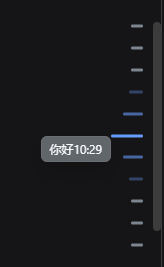

# dsh-question-jump-bar

DSH Web 插件：会话右侧的**问题索引标尺**（Question Jump Bar）+ 会话交互增强。

## 功能

### 问题索引标尺

- 每个刻度对应一次用户提问

- 悬停：刻度弹性放大（最近 32px → 20px → 14px），左侧浮出问题预览气泡

- 点击：平滑滚动到该提问

- 键盘（点击任意刻度聚焦后）：`↑↓` 逐条、`PageUp/PageDown` 翻页、`Home/End` 首尾

- 会话切换 / 新消息 / 滚动实时同步（MutationObserver + ResizeObserver）

### 选中文字 → 追问

参照 reasonix 的 TranscriptSelectionMenu / ComposerContextCard：

- 在会话中选中任意文字（用户消息或 AI 回复），选区正上方出现「追问」浮动按钮

- 点击后**不再把文字塞进输入框**，而是在输入框上方弹出 reasonix 风格的**引用面板**（默认折叠两行，可点「展开/收起」查看全文，可点 × 移除，可选中文字复制但不触发追问按钮）

- 引用面板样式：左侧品牌色竖杠 + 无边框 + 与 sidebar 会话选中高亮同色背景 + 与输入框等宽

- 直接在输入框输入追问内容，按 `Enter` 或点击发送按钮，引用会以**可展开/收起的卡片**形式显示在消息上方，用户输入的内容在下方，两者完全分离

- 点击空白处 / 滚动 / 按下 `Esc` 会收起选区按钮

### 编辑自己的消息并重新发送

参照 reasonix 的 Message 编辑：

- 每条用户消息的复制按钮右侧新增一个**铅笔（编辑）**按钮（lucide Pencil 图标）

- 点击后弹出 composer 输入框风格的编辑面板（`--dsw-specific-input-major` 背景 + 圆角 22px + `--dsw-shadow-lv2` 阴影），预填该消息原文（不含追问引用），光标定位到末尾

- 修改完成后点「重新发送」（或 `Ctrl/Cmd + Enter`），编辑后的文字会作为新消息发送

- 操作行图标使用 lucide-react 原生图标（`Copy` + `Pencil`，描边风格）

### 自定义用户消息渲染器

- 替换 DSH 默认的 user 消息渲染器（`conversation.chat.node` key="user"）

- 解析消息文本中的 `【追问引用】...【/追问引用】` 标记，渲染为可展开/收起的引用卡片

- 用户输入内容以纯文本气泡显示，与引用卡片完全分离

- 保留操作行（复制、编辑）和图片渲染

> 说明：DSH 的历史消息由宿主权威管理，客户端无法原地替换已发送的消息；「重新发送」是把编辑后的文字作为一条新消息发出。原消息保留。



## 安装

### 从 npm

```sh
dsh plugin --profile web add dsh-question-jump-bar -w
```

### 从 GitHub

```sh
dsh plugin --profile web add github:popeye1113/dsh-question-jump-bar -w
```

### 从本地目录 / tarball

```sh
# 本地目录
dsh plugin --profile web add ./dsh-question-jump-bar -w

# 或先打包
npm pack
dsh plugin --profile web add ./dsh-question-jump-bar-1.2.0.tgz -w
```

安装后**重启 dsh web** 使新 bundle 生效。

## 使用

装好并重启后，打开任意会话，右侧会出现垂直刻度轨道：

- 把鼠标移到轨道上：刻度放大 + 预览气泡
- 点击任意刻度：跳转到那一次提问
- 键盘导航：**先点击一下轨道任意位置**（或按 `Tab` 聚焦轨道，聚焦时轨道会有蓝色光圈），然后：
  - `↑` / `↓`：逐条上/下移动
  - `PageUp` / `PageDown`：翻页
  - `Home` / `End`：跳到第一次 / 最后一次提问
  - `Enter`：跳转到当前刻度

## 卸载

```sh
dsh plugin --profile web remove dsh-question-jump-bar -w
```

## License

MIT
